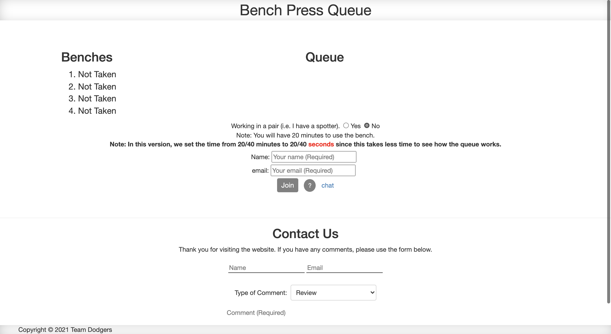
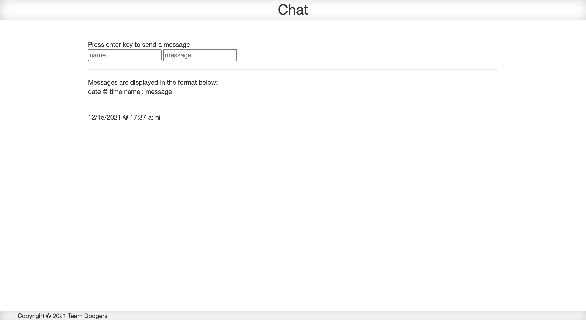
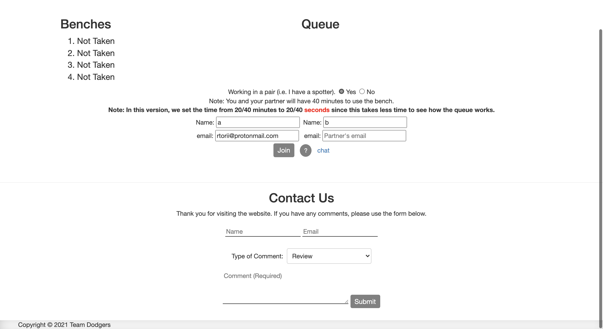
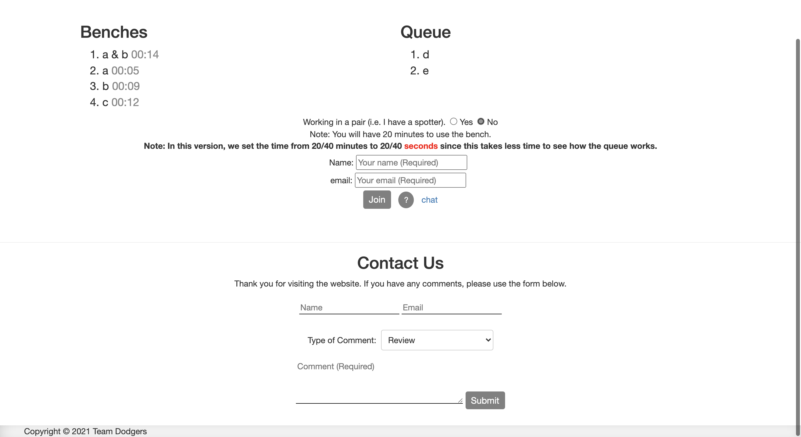

# Bench Press Queue

In a team of four, we created a website that contains a queue for the bench press.

- <a href="https://www.youtube.com/watch?v=bOAJUzm7gR4">Demo Video</a>

| Main page | Chat page |
| ------ | ------ |
|||

**Background:**

Since coming back to school in September 2021, more and more people have been going to the gym at the University of Michigan. The biggest problem that everyone faces is finding an open machine. In particular, the scarcity of bench presses has been an issue since people take a long time on there. And if you take your eyes off it for a second, dozens of people take your spot in line.

To combat this, we created a website where users can join the queue for the bench press. Users in the queue get moved to the first one that opens.

**Description of the system:**

There are four flat benches at the gym. The main page of our website displays the current state of the queue and benches at the gym.  If a bench is not taken, the app displays ‘Not Taken’ for the bench. If it is taken, it displays the name of people using the bench. 

The queue displays the name of users currently waiting to use the bench. For a person to use the bench, they can type in their name and email address to join the queue. When a bench opens up, they will get an email notifying them that it is their turn to use the bench. Each user gets 20 minutes to use the bench. Users can also sign up in pairs. In that case, the pair gets 40 minutes. 

When their time is up, they will get an email notifying them that their time is up. For each person using the bench, the website displays the time remaining for them to use the bench. 

| Sign up in a pair | People in the queue |
| ------ | ------ |
|||

**Technical details:**

We used jQuery library and Vue framework to update the queue and the current state of the benches. 

To send emails, we used Email.send() function from Smtp.js library to send emails to users. The email sometimes end up in the spam folder. We encrypted the SMTP credentials using elasticemail.com. We signed up for a free trial on elasticemail.com which limits the number of emails that can be sent to 100 per day.

To send and receive chat messages, we used API from PubNub Chat. We signed up for PubNub free plan which allows messages to be saved for 7 days. We didn't use the API to save data for the queue. Therefore, the main page resets when the tab is refreshed, but not for the chat page. 

Created by Team Dodgers (Athreya Sundaram, Rishan Singh, Raj Merchant, Ryota Torii) on 12/07/2021.
