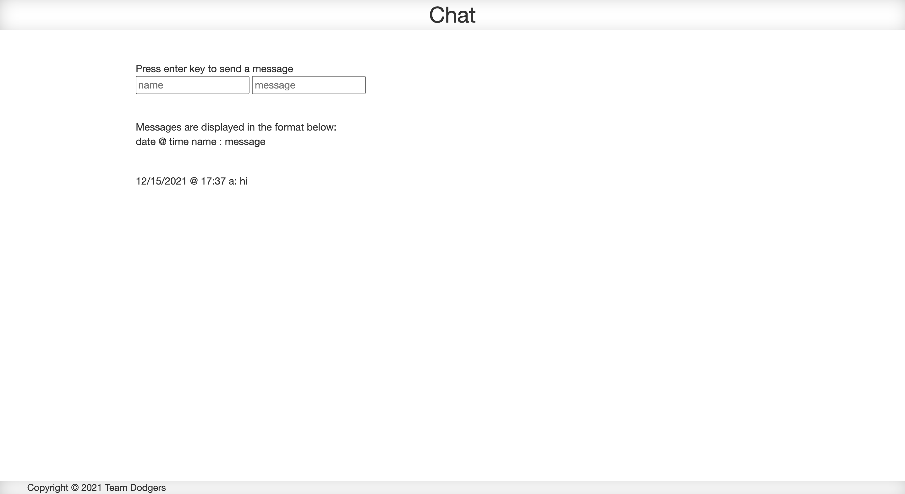
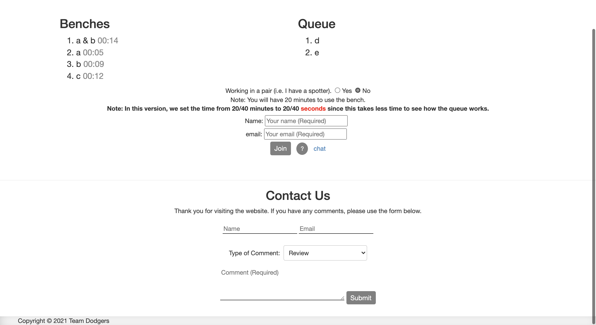

# ベンチプレスの待ち行列

4人のチームで、ミシガン大学のジムのベンチプレスにサインアップできるウェブサイトのプロトタイプを作成しました。

- <a href="https://www.youtube.com/watch?v=bOAJUzm7gR4">説明動画（英語）</a>

| ホームページ | チャットページ |
| ------ | ------ |
|||

**背景:**

2021年9月に対面授業が再開して以来、ミシガン大学のジムに通う人が増えています。ジムを使用する人が直面する最大の問題は、空いているマシンを見つけることです。特に、ベンチプレスは皆長時間かけて使用するので、ベンチプレスの不足が問題になっています。

そこで、ベンチプレスの待ち行列（キュー）にサインアップできるサイトを作りました。待ち行列に並んだユーザーは、最初に空いたベンチプレスに移動することができます。

**ウェブサイトの説明:**

ジムにはフラットベンチが4台あります。ホームページのメインページには、ジムの待ち行列とベンチの現状が表示されます。 ベンチが取られていない場合、アプリにはそのベンチについて「Not Taken」と表示されます。利用されている場合は、そのベンチを利用している人の名前が表示されます。

待ち行列には、現在ベンチの利用を待っているユーザーの名前が表示されます。ベンチを利用する人は、名前とメールアドレスを入力して、待ち行列に参加することができます。ベンチが空くと、自分の順番が来たことを知らせるメールが届きます。ベンチの利用時間は1人20分です。また、2人1組で申し込むこともできます（2人で一つのベンチを使用）。その場合、合計40分の利用が可能です。

時間切れになると、時間切れを知らせるメールが届きます。

| ペアでサインアップ | キュー |
| ------ | ------ |
|||

**技術:**

待ち行列とベンチの現在の状態を更新するために、jQueryライブラリとVue.jsフレームワークを使用しました。

メールの送信には、Smtp.js ライブラリの Email.send() を使用しました。メールは時々スパムフォルダに入ることがあります。SMTPの認証情報はelasticemail.comを使用して暗号化しました。elasticemail.comの無料トライアルにサインアップし、1日に送信できるメールの数を100通に制限しています。

チャットメッセージの送受信には、PubNubチャットのAPIを使用しました。PubNubの無料プランにサインアップし、7日間メッセージを保存することができます。待ち行列に保存するデータにはAPIを使用しませんでした。そのため、タブをリフレッシュするとメインページはリセットされますが、チャットページについてはリセットされません。

12/07/2021にチームドジャース(Athreya Sundaram, Rishan Singh, Raj Merchant, Ryota Torii) によって作成。
